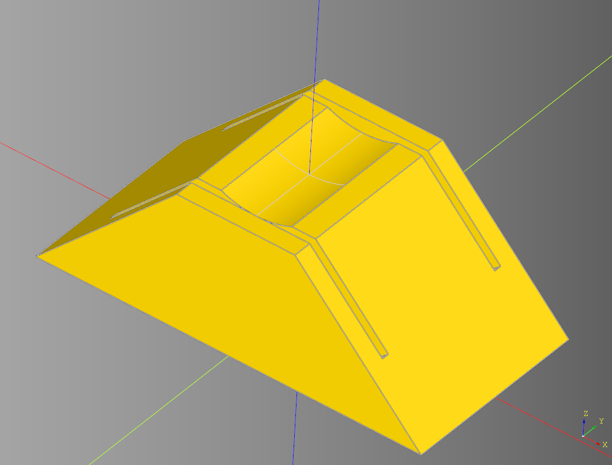

# cqspoolterrain
python Library for making parametric Spool terrain.


<br />




### Example Usage

``` python
import cadquery as cq
from cqspoolterrain import Spool

bp = Spool()
bp.height = 100
bp.radius = 100
bp.wall_width = 3
bp.cut_radius = 40
bp.internal_wall_width = 4
#bp.internal_z_translate = -3
bp.make()
ex = bp.build()

#show_object(ex)
cq.exporters.export(ex,"stl/spool.stl")
```

## Dependencies
* [CadQuery 2.1](https://github.com/CadQuery/cadquery)
* [cqterrain](https://github.com/medicationforall/cqterrain)


### Installation
To install cqspoolterrain directly from GitHub, run the following `pip` command:

	pip install git+https://github.com/medicationforall/cqspoolterrain

**OR**

### Local Installation
From the cloned cqdome directory run.

	pip install ./
