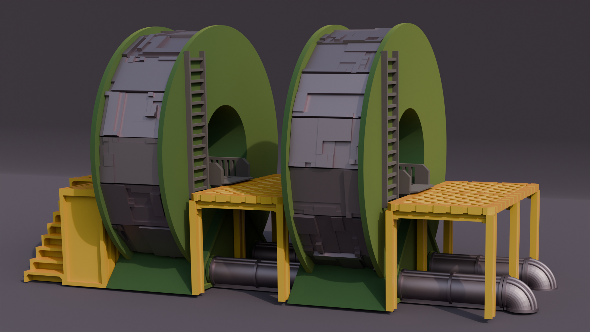

# cqspoolterrain
python Library for making parametric Spool terrain designed for 3d printing.


<br />

### Example Usage

``` python
import cadquery as cq
from cqspoolterrain import PowerStation, SpoolCladdingGreebled

bp_power = PowerStation()
bp_power.bp_cladding = SpoolCladdingGreebled()
bp_power.bp_cladding.seed="morePower!"
bp_power.make()
power = bp_power.build()
#show_object(power)
cq.exporters.export(power,f"stl/powerStation_seed_{bp_power.bp_cladding.seed}.stl")
```

Generates [this stl](stl/powerStation_seed_morePower!.stl)

Refer to [examples directory](example) to see other examples

---

## Project Documention
* [Documentation](documentation/documentation.md)
	* [Spool](documentation/spool.md)
	* [Power Station](documentation/powerstation.md)

## Changes
* [Changelog](./changes.md)

## Dependencies
* [cqindustry](https://github.com/medicationforall/cqindustry)

---

## 3d Printed Projects
* [Spool Power Station Terrain](https://miniforall.com/powerstation)

[](https://miniforall.com/powerstation)

---


### Installation
To install cqspoolterrain directly from GitHub, run the following `pip` command:

	pip install git+https://github.com/medicationforall/cqspoolterrain

**OR**

### Local Installation
From the cloned cqdome directory run.

	pip install ./


---

## Running Example Scripts
[example_runner.py](example_runner.py) runs all examples.

``` bash
C:\Users\<user>\home\3d\cqspoolterrain>python example_runner.py
```

**OR**

### Running individual examples
* From the root of the project run one of the example scripts:
  
``` bash
C:\Users\<user>\home\3d\cqspoolterrain>python ./example/spool.py
```
