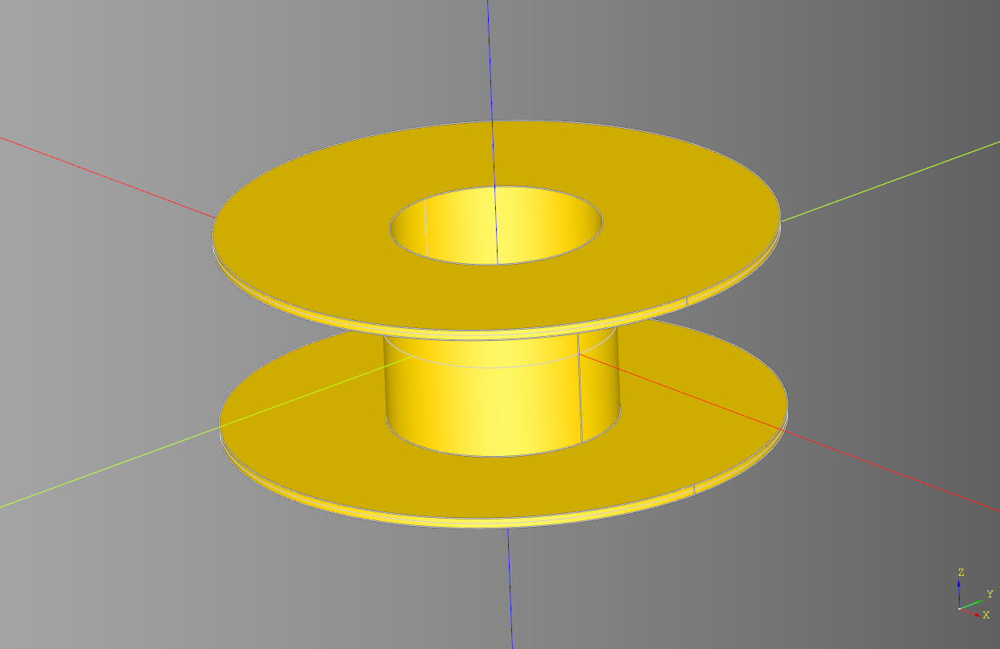

# cqdome
python Library for making parametric Spool terrain.





### Example Usage

``` python
```

## Dependencies
* [CadQuery 2.1](https://github.com/CadQuery/cadquery)
* [cqterrain](https://github.com/medicationforall/cqterrain)


### Installation
To install cqspoolterrain directly from GitHub, run the following `pip` command:

	pip install git+https://github.com/medicationforall/cqspoolterrain

**OR**

### Local Installation
From the cloned cqdome directory run.

	pip install ./
