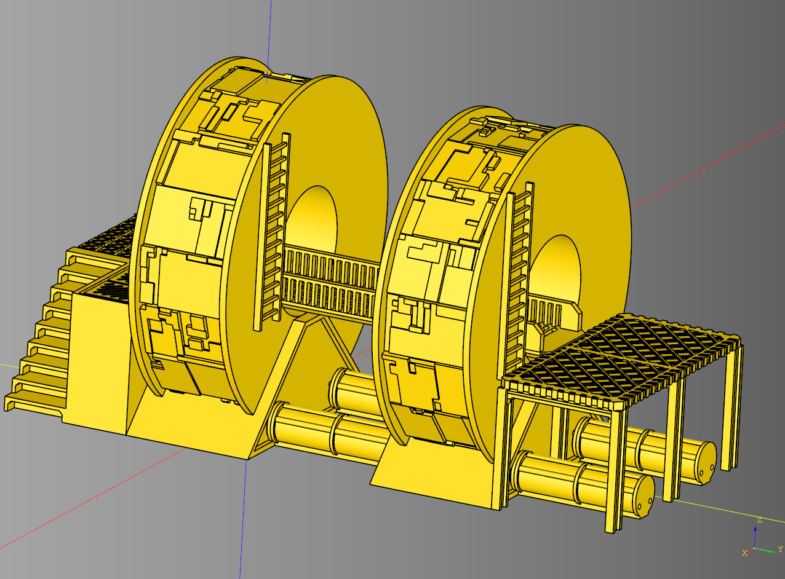

# cqspoolterrain
python Library for making parametric Spool terrain designed for 3d printing.


<br />

### Example Usage

``` python
import cadquery as cq
from cqspoolterrain import PowerStation, SpoolCladdingGreebled

bp_power = PowerStation()
bp_power.bp_cladding = SpoolCladdingGreebled()
bp_power.bp_cladding.seed="morePower!"
bp_power.make()
power = bp_power.build()
#show_object(power)
cq.exporters.export(power,f"stl/powerStation_seed_{bp_power.bp_cladding.seed}.stl")
```

Generates [this stl](stl/powerStation_seed_morePower!.stl)

Refer to [examples directory](example) to see other examples


## Dependencies
* [CadQuery 2.1](https://github.com/CadQuery/cadquery)
* [cqterrain](https://github.com/medicationforall/cqterrain)


### Installation
To install cqspoolterrain directly from GitHub, run the following `pip` command:

	pip install git+https://github.com/medicationforall/cqspoolterrain

**OR**

### Local Installation
From the cloned cqdome directory run.

	pip install ./
